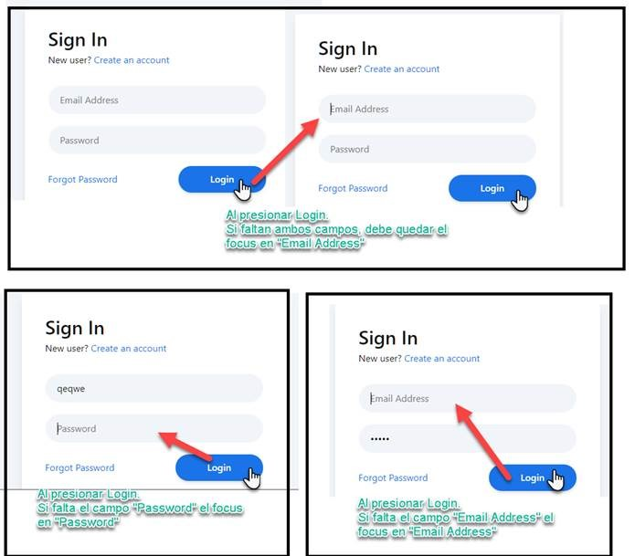
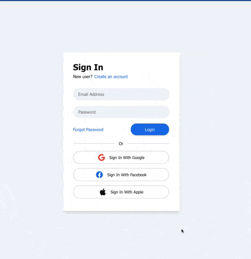

# Proyecto para estudio de react

este proyecto se utiliza para capacitaciones internas de HQB sobre react js y tecnologias complementarias

## Semana 05 - DOM y Referencias

En un proyecto de React. Tiene que crear un componente que use el html y css del código de la siguiente página https://codepen.io/syahrizaldev/pen/ZEOOVwN. Obviamente modificando lo que no aplique, por ejemplo modificar “class” por el “className”.
Utilizando referencias para los input de “Email Address” y “Password” debe aplicar el focus en uno u otro elemento al presionar “Login”. Tal como se muestra en la siguiente imagen:

## Desarrollo del Ejercicio

