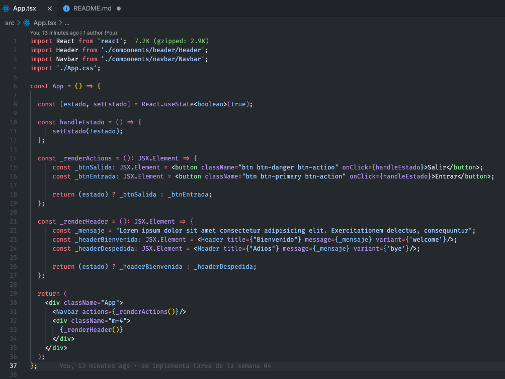
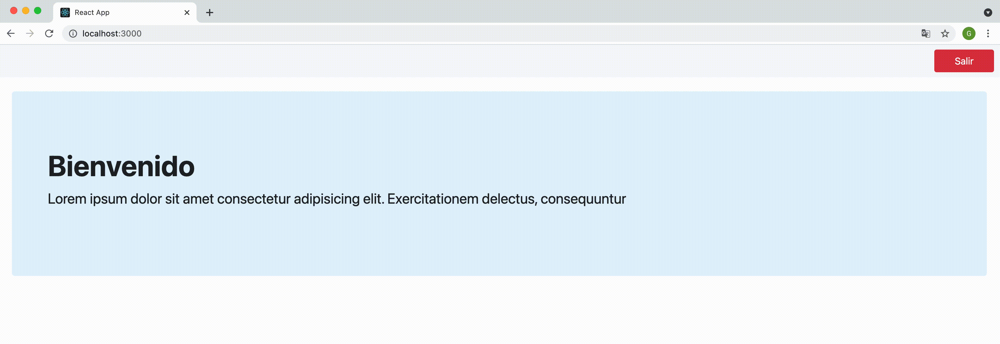

# Proyecto para estudio de react

este proyecto se utiliza para capacitaciones internas de HQB sobre react js y tecnologias complementarias

## Semana 04 - Conditional Rendering

Se aplica el conditional rendering en el componente de APP el cual llama a un componente header dependiendo de un estado declarado.

### Código (App.tsx)

### Ejemplo del código compilado:

