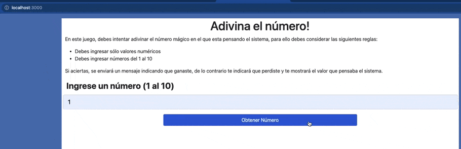

# Proyecto para estudio de react

este proyecto se utiliza para capacitaciones internas de HQB sobre react js y tecnologias complementarias

## Semana 08 - Promesas

* Crear una función que contenga un método con Promise, que dé la oportunidad de adivinar un número generado de forma aleatoria.
* Crear un formulario que conste de un input de texto y un botón que ejecute la acción de enviar un parámetro a la función.
* En caso de adivinar el número, debe desplegar una alerta de felicitaciones.
* En caso de no adivinar debe desplegar una alerta que no adivinó.
* En caso de ingresar un texto, debe desplegar una alerta con un error “Debe ingresar solo números”
* El tiempo de respuesta debe estar seteado en 5 segundos.

## Desarrollo del Ejercicio

